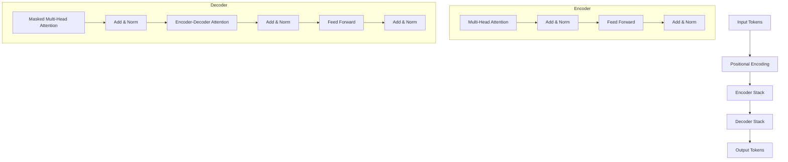

# 🏆 Transformer: The GOAT of Modern AI 🚀

> "Attention is all you need." — The paper that changed the world forever.

트랜스포머(Transformer)는 현대 생성형 AI(Generative AI)의 심장이자, 모든 거대 언어 모델(LLM)의 기원입니다. 이 문서는 트랜스포머의 정수를 파헤치는 **압도적 지식 가이드**입니다.

---

## 💎 Why it's the GOAT?
기존의 RNN, LSTM은 문장을 순차적으로 읽어야 했습니다. 하지만 트랜스포머는 **병렬 처리(Parallelism)**를 도입하여 학습 속도를 수천 배 끌어올렸고, **멀리 떨어진 단어 사이의 관계**도 즉각적으로 파악하는 혁신을 이뤄냈습니다.

### 🌟 핵심 가치
1. **Scalability:** 데이터가 많을수록, 모델이 클수록 기하급수적으로 똑똑해집니다.
2. **Context Mastery:** 문장의 전체적인 맥락을 '한눈에' 훑어봅니다.
3. **Versatility:** 텍스트를 넘어 이미지(ViT), 오디오, 영상까지 정복했습니다.

---

## 🧠 The Heart: Self-Attention (Spotlight Mechanism)

셀프 어텐션은 문장 속 단어들이 서로를 어떻게 '바라보는지' 결정합니다.

> **예시:** "The **bank** of the river was muddy." vs "I went to the **bank** to deposit money."
>
> 트랜스포머는 주변 단어(river vs money)에 **스포트라이트(Attention)**를 비추어 'bank'의 정확한 의미를 순식간에 구분합니다.

### ⚙️ Mechanism (Q, K, V)
| 요소 | 역할 | 비유 |
| :--- | :--- | :--- |
| **Query (Q)** | 질문하는 주체 | "내가 누구랑 관련이 있지?" |
| **Key (K)** | 답변의 후보 | "나는 이런 특징을 가진 단어야" |
| **Value (V)** | 실제 정보 값 | "연관 있다면 나를 이만큼 참고해" |

---

## 🏗️ Architecture Blueprint



---

## 🛠️ Implementation (The "GOAT" Snippet)

단순한 사용법을 넘어, 핵심인 **Scaled Dot-Product Attention**을 직접 구현하는 코드는 모델의 원리를 이해하는 가장 빠른 길입니다.

```python
import torch
import torch.nn as nn
import torch.nn.functional as F

class ScaledDotProductAttention(nn.Module):
    """트랜스포머의 핵심 엔진"""
    def __init__(self, d_k):
        super().__init__()
        self.scale = torch.sqrt(torch.FloatTensor([d_k]))

    def forward(self, Q, K, V, mask=None):
        # 1. 점곱 유사도 계산 (Q * K^T)
        scores = torch.matmul(Q, K.transpose(-2, -1)) / self.scale
        
        # 2. 마스킹 (선택 사항 - 미래 단어 가리기)
        if mask is not None:
            scores = scores.masked_fill(mask == 0, -1e9)
        
        # 3. 소프트맥스로 가중치 확률 변환
        attn = F.softmax(scores, dim=-1)
        
        # 4. 가중치를 Value에 곱해 최종 맥락 벡터 생성
        context = torch.matmul(attn, V)
        return context, attn

# 사용 예시 (d_k=64)
attention = ScaledDotProductAttention(d_k=64)
print("🚀 Attention Engine Initialized!")
```

---

## 🚀 RAG: Transformer on Steroids

트랜스포머가 '똑똑한 뇌'라면, **RAG(검색 증강 생성)**는 '최신 백과사전'입니다.

1. **Retrieval:** 외부 DB에서 질문과 가장 관련 있는 문서를 빛의 속도로 검색.
2. **Augmentation:** 검색된 정보를 프롬프트 앞에 "참고해!"라며 붙여줌.
3. **Generation:** 트랜스포머가 이 근거 자료를 바탕으로 팩트 체크된 답변을 생성.

> [!TIP]
> **왜 RAG인가?** 모델을 매번 재학습(Fine-tuning)시키는 것보다 훨씬 저렴하고, 실시간 정보 업데이트가 가능하기 때문입니다.

---

## 🌌 The Future
트랜스포머는 이제 **Long-context** (수백만 토큰 처리)와 **Multimodal** (보고 듣고 말하기)의 시대로 진입했습니다. 당신의 프로젝트에 트랜스포머를 심는 순간, 가능성은 무한해집니다.

---
**Created by Antigravity AI**